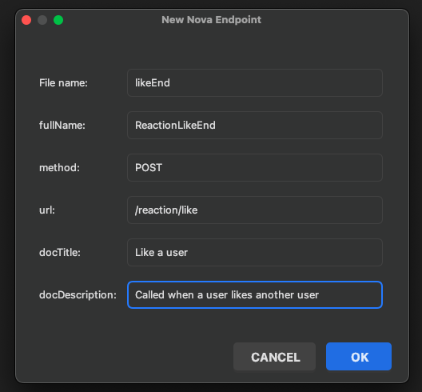

## Adding a new end-point to the project

To add a new endpoint to the project, you need to create an endpoint ts file into `src/endpoints` directory, and add it into `ends.ts` file.

Each endpoint contains different an `input interface`, `output interface` and the `main endpoint object`.

## Creating the file

You can manually define the `.ts` file or use `File Templates` in intellij IDE.

You can get the file template from [here](file_templates/endpoint_file_template.txt) and add it to your ide file templates.



## Input Interface

Inputs of the endpoint are defined here. It is a representation of the `body for POST requests` and `query-params for GET requests`.

For example, when the user opens the mini-app, the `user/getToken` endpoint is called and it receives a hash value:

```ts
interface IUserGetTokenEndInput extends IEndInput {
    hash: string;
}
```

## Output Interface

Defines what is the expected response for each endpoint.
For example in `user/getToken` endpoint, we will receive `session` and `user` data:

```ts
interface IUserGetTokenEndResponse {
    session: {
        token: string;
    };
    user: Partial<IUser>;
}
```

## Main Endpoint Object

Each endpoint contains an object that defines the `access-level configurations`, `url and method` of the endpoint,
`validation rules` for input, `handler` and `docs` data.

#### Configurations

Defines who can access an endpoint. Each endpoint can be **public**, restricted to **login** users or only for **users with specific roles**.

#### Path / Method

The path and method (In this project, `GET` or `POST`) can be configured here.

#### Handler

This function will be called whenever the endpoint is called. It contains users login data (from token header) and input.

#### Docs

The title, description and sample input data from here, will be used to generate the **Postman collection file**, and uploading it into clouds!
These data are used when you run `npm run docs`.